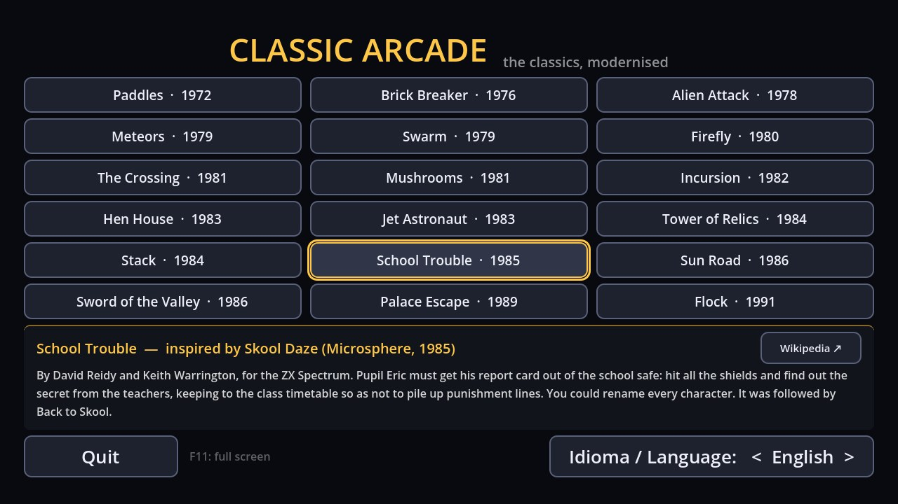

# Arcade Clássico

*[Versão em português](README.pt.md)*

**18 original games inspired by the classics of the 70s, 80s and 90s**, made with **Godot 4.7** (GDScript), with builds for **Windows, Linux and Android**.

Every game has three visual styles — one faithful to the look of its era, one modern and popular (neon, cartoon...) and one created from scratch for this project — that share exactly the same gameplay and can be switched live from the menu. All graphics, sound effects and music are generated in code: there are no image or audio files.

On the launcher, a footer shows the classic that inspired the focused (or hovered) game, a short history and a link to Wikipedia. On touch screens, where tapping a game opens it straight away, an **i** button next to each game does the same.

The game is available in **English, Portuguese and Spanish** — it follows the system language and can be changed on the launcher ("Idioma / Language").



## The games

| Game | Inspired by | Styles |
|---|---|---|
| **Raquetes** (1972) — paddles | [Pong](https://en.wikipedia.org/wiki/Pong) (Atari, 1972) | Classic 1972 · Neon · Paper & Ink |
| **Quebra-Tijolos** (1976) — brick breaker | [Breakout](https://en.wikipedia.org/wiki/Breakout_(video_game)) (Atari, 1976) | Classic 1976 · Neon · Stained Glass |
| **Ataque Alienígena** (1978) — alien attack | [Space Invaders](https://en.wikipedia.org/wiki/Space_Invaders) (Taito, 1978) | Classic 1978 · Neon · Azulejo (Portuguese tiles) |
| **Meteoros** (1979) — meteors | [Asteroids](https://en.wikipedia.org/wiki/Asteroids_(video_game)) (Atari, 1979) | Classic 1979 · Neon · Origami |
| **Enxame** (1979) — swarm | [Galaxian](https://en.wikipedia.org/wiki/Galaxian) (Namco, 1979) | Classic 1979 · Neon · Ocean |
| **Pirilampo** (1980) — firefly maze chase | [Pac-Man](https://en.wikipedia.org/wiki/Pac-Man) (Namco, 1980) | Arcade 1980 · Neon · Shadow Theatre |
| **Travessia** (1981) — the crossing | [Frogger](https://en.wikipedia.org/wiki/Frogger) (Konami, 1981) | Classic 1981 · Neon · Felt |
| **Cogumelos** (1981) — mushrooms | [Centipede](https://en.wikipedia.org/wiki/Centipede_(video_game)) (Atari, 1981) | Classic 1981 · Neon · Naturalist Engraving |
| **Incursão** (1982) — incursion | [Penetrator](https://en.wikipedia.org/wiki/Penetrator_(video_game)) (Melbourne House, 1982) | Classic 1982 · Neon · Topographic Map |
| **Galinheiro** (1983) — hen house | [Chuckie Egg](https://en.wikipedia.org/wiki/Chuckie_Egg) (A&F Software, 1983) | Classic 1983 · Neon · Cross-stitch |
| **Astronauta a Jato** (1983) — jet astronaut | [Jetpac](https://en.wikipedia.org/wiki/Jetpac) (Ultimate Play the Game, 1983) | Classic 1983 · Neon · Comic Book |
| **Torre das Relíquias** (1984) — tower of relics, isometric | [Knight Lore](https://en.wikipedia.org/wiki/Knight_Lore) (Ultimate Play the Game, 1984) | Classic 1984 · Neon · Geometric Pastel |
| **Encaixe** (1984) — falling blocks | [Tetris](https://en.wikipedia.org/wiki/Tetris) (Alexey Pajitnov, 1984) | Classic 1984 · Neon · Wooden Toy |
| **Sarilhos na Escola** (1985) — school trouble | [Skool Daze](https://en.wikipedia.org/wiki/Skool_Daze) (Microsphere, 1985) | Classic 1985 · Chalkboard · Cartoon |
| **Estrada do Sol** (1986) — sun road racing | [Out Run](https://en.wikipedia.org/wiki/Out_Run) (Sega, 1986) | Classic 1986 · Synthwave · Travel Poster |
| **Espada do Vale** (1986) — sword of the valley | [The Legend of Zelda](https://en.wikipedia.org/wiki/The_Legend_of_Zelda_(video_game)) (Nintendo, 1986) | Classic 1986 · Handheld Console · Watercolour |
| **Fuga do Palácio** (1989) — palace escape | [Prince of Persia](https://en.wikipedia.org/wiki/Prince_of_Persia_(1989_video_game)) (Jordan Mechner, 1989) | Classic 1989 · Silhouette · Persian Miniature |
| **Rebanho** (1991) — the flock | [Lemmings](https://en.wikipedia.org/wiki/Lemmings_(video_game)) (DMA Design / Psygnosis, 1991) | Classic 1991 · Clay · Notebook Doodles |

Each game has a demo running behind its menu, a saved high score and, where it makes sense, two-player modes, keyboard, mouse, gamepad and touch controls. The [Portuguese README](README.pt.md) describes every style, the controls and the rules of each game in detail.

> **Disclaimer:** this is a non-commercial fan project. The names of the games that served as inspiration are trademarks of their respective owners and are mentioned only to credit that inspiration; this project is not affiliated with or endorsed by those companies. All code, graphics, sounds and music are original.

## Screenshots

Each image shows the three styles of the game, from left to right (classic, popular, original).

**Paddles** (Raquetes)


**Brick Breaker** (Quebra-Tijolos)


**Alien Attack** (Ataque Alienígena)


**Meteors** (Meteoros)


**Swarm** (Enxame)


**Firefly** (Pirilampo)


**The Crossing** (Travessia)


**Mushrooms** (Cogumelos)


**Incursion** (Incursão)


**Hen House** (Galinheiro)


**Jet Astronaut** (Astronauta a Jato)


**Tower of Relics** (Torre das Relíquias)


**Stack** (Encaixe)


**School Trouble** (Sarilhos na Escola)


**Sun Road** (Estrada do Sol)


**Sword of the Valley** (Espada do Vale)


**Palace Escape** (Fuga do Palácio)


**Flock** (Rebanho)


## Running the project

1. Install [Godot 4.7](https://godotengine.org/download) (standard version, not .NET).
2. In the Project Manager: **Import** → choose `project.godot`.
3. Press **F5** to play.

In every game: **Esc / P / Start** pauses; **F11** toggles fullscreen; on Android the "back" button pauses and returns to the menu.

## Project structure

```
core/                  shared by all games
  main.gd / main.tscn  launcher (game list and the "inspired by" panel)
  inspirations.gd      the classics that inspired each game, with a short history and Wikipedia link
  synth.gd             tiny synthesizer: every sound is generated in code
  ui.gd                menu theme generated from each style's palette
  pixel_font.gd        5x7 pixel font; pixel_art.gd: multicolour pixel drawings
  settings.gd          saved preferences (user://settings.cfg)
  i18n.gd              translations (I18n.t); the texts are in i18n/strings.json
games/<game>/
  <game>_game.gd       pure game logic (rules, physics, demo AI, input) — emits signals
  <game>_main.gd       menus, pause, game over, high score, style switching
  skins/<game>_skin.gd base class of a visual style (drawing + sounds + reactions to events)
  skins/*.gd           the three styles
```

The folders and class names keep the short internal names used during development (`pong`, `breakout`...).

**New style:** extend the game's skin base class, draw in `_draw()` from `game`, create the sounds in `_build_sfx()` and add it to `SKINS` in the game's `*_main.gd`.

**New game:** create `games/<game>/<game>_main.gd` (a `Node` with an `exit_requested` signal and a `go_back()` method), register it in `GAMES` in `core/main.gd` and add its inspiration to `core/inspirations.gd`.

**Translations:** the original text (Portuguese) is the key; the code wraps every visible string with `I18n.t("...")`. The English and Spanish texts live in `i18n/strings.json` (`{"Portuguese text": ["English", "Spanish"]}`); after editing it, run `python3 i18n/build.py` to regenerate `i18n/strings.gd`. A missing translation simply shows the Portuguese text. Adding a language means adding a column to the JSON and to `I18n.LANGS`/`LANG_NAMES` in `core/i18n.gd`.

Renderer: *Compatibility* (OpenGL), to run on older PCs and most Android phones.

## Builds

Export presets are in `export_presets.cfg` (Windows, Linux, Android and Web).

- **Editor:** **Project → Export** → choose the platform → **Export Project** (the first time, Godot asks to download the export templates).
- **Command line:** `./build.sh` (all) or `./build.sh windows|linux|android|web` (set `GODOT=/path/to/godot` if it is not in the PATH).
- **Android:** needs JDK 17, the Android SDK and a debug keystore, configured in **Editor → Editor Settings → Export → Android** ([official guide](https://docs.godotengine.org/en/stable/tutorials/export/exporting_for_android.html)). The APK is signed with the debug key; publishing on the Play Store needs your own release keystore (never commit it).
- **Web:** exported without threads (*Thread Support* off), so it runs on any static file server, GitHub Pages included, with no special headers. To try it locally, export to a folder and run `python3 -m http.server` there.
- **GitHub Actions:** `.github/workflows/builds.yml` runs on every push to `main`: it builds Windows, Linux, Android and Web (under **Actions → Artifacts**) and publishes the web version to **GitHub Pages** (enable it once in **Settings → Pages → Source: GitHub Actions**; it is served at `https://<user>.github.io/<repository>/`). Pushing a `v*` tag (`git tag v1.0.0 && git push --tags`) also creates a **Release** with the downloadable files.

## License

The code is released under the [MIT License](LICENSE). The [Godot](https://godotengine.org) engine is also MIT-licensed.
