# Arcade Clássico

*[English version](README.md)*

### ▶ [Jogar no browser](https://mcampilho.github.io/classic-games/)

18 jogos originais inspirados nos clássicos dos anos 70, 80 e 90, feitos em **Godot 4.7** (GDScript), com builds para **Windows, Linux e Android**.

Cada jogo tem três estilos visuais — um fiel ao aspeto da época, um moderno e popular (neon, desenho animado...) e um criado de raiz para este projeto — que partilham exatamente a mesma jogabilidade e trocam-se em tempo real no menu. Os gráficos, os sons e as músicas são todos gerados em código: não há imagens nem ficheiros de áudio.

O jogo está em **português, inglês e espanhol**: segue o idioma do sistema e pode ser mudado no ecrã inicial ("Idioma / Language").

No ecrã inicial, o rodapé mostra o clássico que inspirou o jogo com o foco (ou debaixo do rato), uma breve história e a ligação para a Wikipédia. Nos ecrãs táteis, onde tocar num jogo o abre logo, há um botão **i** ao lado de cada jogo para isso.

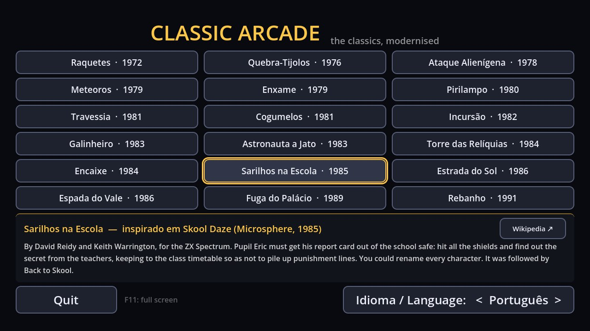

| Jogo | Inspirado em |
|---|---|
| [Raquetes (1972)](#raquetes-1972) | [Pong](https://pt.wikipedia.org/wiki/Pong) (Atari, 1972) |
| [Quebra-Tijolos (1976)](#quebra-tijolos-1976) | [Breakout](https://pt.wikipedia.org/wiki/Breakout_(jogo_eletr%C3%B4nico)) (Atari, 1976) |
| [Ataque Alienígena (1978)](#ataque-alienígena-1978) | [Space Invaders](https://en.wikipedia.org/wiki/Space_Invaders) (Taito, 1978) |
| [Meteoros (1979)](#meteoros-1979) | [Asteroids](https://en.wikipedia.org/wiki/Asteroids_(video_game)) (Atari, 1979) |
| [Enxame (1979)](#enxame-1979) | [Galaxian](https://en.wikipedia.org/wiki/Galaxian) (Namco, 1979) |
| [Pirilampo (1980)](#pirilampo-1980) | [Pac-Man](https://en.wikipedia.org/wiki/Pac-Man) (Namco, 1980) |
| [Travessia (1981)](#travessia-1981) | [Frogger](https://en.wikipedia.org/wiki/Frogger) (Konami, 1981) |
| [Cogumelos (1981)](#cogumelos-1981) | [Centipede](https://en.wikipedia.org/wiki/Centipede_(video_game)) (Atari, 1981) |
| [Incursão (1982)](#incursão-1982) | [Penetrator](https://en.wikipedia.org/wiki/Penetrator_(video_game)) (Melbourne House, 1982) |
| [Galinheiro (1983)](#galinheiro-1983) | [Chuckie Egg](https://en.wikipedia.org/wiki/Chuckie_Egg) (A&F Software, 1983) |
| [Astronauta a Jato (1983)](#astronauta-a-jato-1983) | [Jetpac](https://en.wikipedia.org/wiki/Jetpac) (Ultimate Play the Game, 1983) |
| [Torre das Relíquias (1984)](#torre-das-relíquias-1984) | [Knight Lore](https://en.wikipedia.org/wiki/Knight_Lore) (Ultimate Play the Game, 1984) |
| [Encaixe (1984)](#encaixe-1984) | [Tetris](https://en.wikipedia.org/wiki/Tetris) (Alexey Pajitnov, 1984) |
| [Sarilhos na Escola (1985)](#sarilhos-na-escola-1985) | [Skool Daze](https://en.wikipedia.org/wiki/Skool_Daze) (Microsphere, 1985) |
| [Estrada do Sol (1986)](#estrada-do-sol-1986) | [Out Run](https://en.wikipedia.org/wiki/Out_Run) (Sega, 1986) |
| [Espada do Vale (1986)](#espada-do-vale-1986) | [The Legend of Zelda](https://pt.wikipedia.org/wiki/The_Legend_of_Zelda_(jogo_eletr%C3%B4nico)) (Nintendo, 1986) |
| [Fuga do Palácio (1989)](#fuga-do-palácio-1989) | [Prince of Persia](https://pt.wikipedia.org/wiki/Prince_of_Persia_(jogo_eletr%C3%B4nico_de_1989)) (Jordan Mechner, 1989) |
| [Rebanho (1991)](#rebanho-1991) | [Lemmings](https://pt.wikipedia.org/wiki/Lemmings_(jogo_eletr%C3%B4nico)) (DMA Design / Psygnosis, 1991) |

> **Aviso:** este é um projeto de fãs, sem fins comerciais. Os nomes dos jogos que serviram de inspiração são marcas registadas dos respetivos donos e só são referidos para indicar essa inspiração; este projeto não tem qualquer ligação a essas empresas. Todo o código, gráficos, sons e músicas são originais.

## Abrir o projeto

1. Instala o [Godot 4.7](https://godotengine.org/download) (versão normal, não .NET).
2. No Project Manager: **Import** → escolhe `project.godot`.
3. **F5** para jogar.

Em todos os jogos: **Esc / P / Start** pausa; **F11** ecrã inteiro; no Android o botão "voltar" pausa e volta ao menu.

## Raquetes (1972)

*Inspirado em [Pong](https://pt.wikipedia.org/wiki/Pong) (Atari, 1972).*

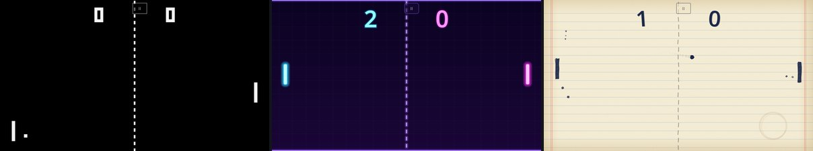

| Estilo | O que é |
|---|---|
| **Clássico 1972** | Fiel ao original: preto e branco, bola quadrada, rede tracejada, marcador em blocos e os três "bips" de onda quadrada. |
| **Neon** | Brilho aditivo, rasto da bola, faíscas, ondas de choque, ecrã a tremer e sons sintetizados que sobem de tom com a velocidade da jogada. |
| **Papel & Tinta** | Um jogo de raquetes na margem de um caderno: traço a tinta "a ferver", salpicos que ficam no papel, marcador a caneta com círculo vermelho e sons acústicos (madeira, lápis, sino). |

### Controlos

| | Jogador 1 (esquerda) | Jogador 2 (direita) |
|---|---|---|
| Teclado | W / S | Setas ↑ / ↓ |
| Comando | Analógico/D-pad do comando 1 | Comando 2 |
| Ecrã tátil | Arrastar na metade esquerda | Arrastar na metade direita |

Contra a CPU qualquer conjunto de teclas controla a tua raquete.

No ecrã tátil (e com o rato, a arrastar) a raquete segue o dedo em posição absoluta — tal como o botão rotativo da máquina original.

### Regras (iguais ao original)

- Ganha quem chegar primeiro a **11 pontos**.
- A raquete divide-se em **8 segmentos**; cada um devolve a bola com um ângulo fixo (as pontas dão os ângulos mais fechados).
- A bola **acelera após 4 e 12 toques** na mesma jogada.
- O serviço vai para quem sofreu o ponto.

## Quebra-Tijolos (1976)

*Inspirado em [Breakout](https://pt.wikipedia.org/wiki/Breakout_(jogo_eletr%C3%B4nico)) (Atari, 1976).*

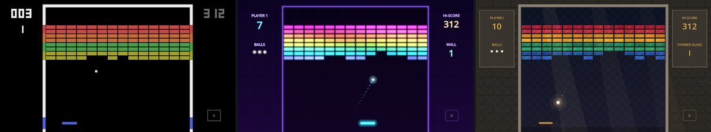

| Estilo | O que é |
|---|---|
| **Clássico 1976** | Como na máquina da Atari: monitor a preto e branco com tiras de celofane colorido coladas no vidro — por isso a bola e as paredes mudam de cor ao passar em cada faixa e a raquete é azul. Bips de onda quadrada com um tom por cor de tijolo. |
| **Neon** | Tijolos de luz num arco-íris elétrico, faíscas, ondas de choque, pontos a flutuar e **combos**: cada tijolo seguido sem tocar na raquete soa meio tom acima. |
| **Vitral** | A parede é um vitral de catedral. A bola é uma esfera de luz que ilumina os vidros por onde passa; cada vidro partido cai em estilhaços e deixa só a moldura de chumbo. Sons de vidro, bronze, pedra e sinos. |

### Controlos

| | |
|---|---|
| Teclado | ← → ou A / D · lançar: Espaço / Enter |
| Rato | a raquete segue o cursor · clique para lançar |
| Comando | analógico / D-pad · lançar: A |
| Ecrã tátil | arrastar em qualquer sítio do ecrã (movimento relativo, o dedo não tapa a raquete) · toque para lançar |

### Regras (iguais ao original)

- 8 filas de 14 tijolos: vermelhos **7** pontos, laranja **5**, verdes **3**, amarelos **1**.
- A bola acelera aos **4** e aos **12** toques na raquete e quando toca pela 1.ª vez nas filas **laranja** e **vermelhas**.
- Quando a bola atravessa a parede e bate no topo, a raquete **encolhe para metade** (até à parede seguinte).
- A raquete divide-se em 8 segmentos; as pontas devolvem a bola com ângulos mais abertos.
- **3 bolas** (ou 5, nas opções). Modo de **2 jogadores à vez**, cada um com a sua parede, como na máquina.
- Ao limpar uma parede aparece outra (no original eram só duas; aqui continua sem limite). O recorde fica guardado.

## Ataque Alienígena (1978)

*Inspirado em [Space Invaders](https://en.wikipedia.org/wiki/Space_Invaders) (Taito, 1978).*

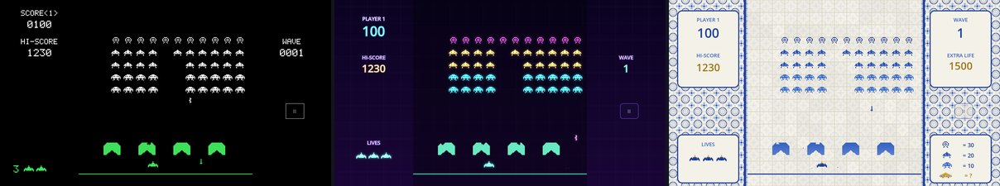

| Estilo | O que é |
|---|---|
| **Clássico 1978** | Monitor a preto e branco com tiras de celofane: vermelha em cima (zona do disco voador) e verde em baixo (abrigos e canhão). Letra de píxeis, a marcha de 4 notas graves e os sons de onda quadrada. |
| **Neon** | Invasores de luz que pulsam ao ritmo da marcha, faíscas, ondas de choque, pontos a flutuar e uma linha de baixo sintetizada. |
| **Azulejo** | A invasão pintada num painel de azulejos portugueses: invasores a azul-cobalto com pinceladas irregulares, disco e canhão com ocre, azulejos que estalam e lascas de cerâmica a cair. Sons de marimba, cerâmica e sinos. |

Os desenhos dos invasores, do disco voador e do canhão são originais (no mesmo espírito, mas não são os sprites da Taito).

### Controlos

| | |
|---|---|
| Teclado | ← → ou A / D · disparar: Espaço / W / ↑ |
| Rato | o canhão segue o cursor · clique (ou manter) para disparar |
| Comando | analógico / D-pad · disparar: A ou X |
| Ecrã tátil | arrastar em qualquer sítio (movimento relativo) · enquanto o dedo estiver no ecrã, dispara sozinho |

### Regras (iguais ao original)

- 5 filas de 11 invasores: fila de cima **30** pontos, as duas do meio **20**, as duas de baixo **10**.
- A frota marcha em bloco e desce ao tocar na margem. Move-se ao ritmo de um invasor por fotograma, por isso **acelera à medida que vão caindo** (e a batida da marcha também).
- Se a frota chegar ao canhão, o jogo acaba.
- 1 tiro de cada vez; até 3 bombas inimigas (uma em cada três é apontada ao canhão).
- 4 abrigos que se desfazem com tiros, bombas e com os próprios invasores.
- Disco voador a cada ~25 s, com pontos "misteriosos" (50–300) que dependem do número de tiros disparados.
- Vida extra aos **1500** pontos. Cada vaga nova começa mais abaixo. Modo de 2 jogadores à vez.

## Meteoros (1979)

*Inspirado em [Asteroids](https://en.wikipedia.org/wiki/Asteroids_(video_game)) (Atari, 1979).*

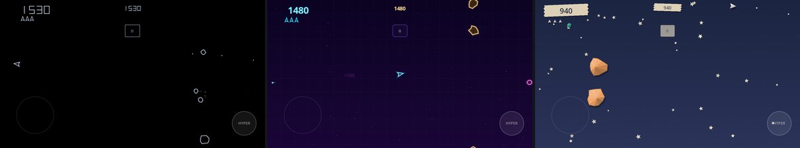

| Estilo | O que é |
|---|---|
| **Clássico 1979** | Monitor vetorial: linhas brancas finas com brilho de fósforo, algarismos traçados a vetor, explosões em pontos e a nave a desfazer-se em segmentos. A "batida" de 2 notas, o motor e as sirenes dos discos. |
| **Neon** | Asteroides de luz em cores elétricas, rasto do motor, tiros com cauda, faíscas, ondas de choque e pontos a flutuar. |
| **Origami** | Asteroides de papel amarrotado e facetado (as sombras mudam ao rodar), a nave é um avião de papel e o disco voador um barquinho. Céu de cartolina com estrelas recortadas, confettis e sons de papel. |

### Controlos

| | |
|---|---|
| Teclado | rodar ← → (A / D) · acelerar ↑ (W) · disparar Espaço · hiperespaço ↓ (S) ou Shift |
| Rato | a nave aponta para o cursor · clique dispara · botão direito acelera · botão do meio: hiperespaço |
| Comando | analógico para rodar (para cima acelera) · A/X dispara · RB/RT acelera · Y/LB hiperespaço |
| Ecrã tátil | metade esquerda: joystick (a nave vira para onde apontas e acelera se empurrares mais) · metade direita: disparar · botão "HIPER" |

### Regras (iguais ao original)

- Asteroides grandes (**20** pts) partem-se em 2 médios (**50**), que se partem em 2 pequenos (**100**).
- Tudo dá a volta ao ecrã. A nave tem inércia; no máximo 4 tiros no ecrã.
- Hiperespaço: a nave reaparece num sítio ao acaso — e às vezes explode ao regressar.
- Disco voador grande (**200** pts, dispara ao acaso) e pequeno (**1000** pts, aponta à nave, cada vez melhor).
- A batida de 2 notas acelera ao longo da vaga. Vida extra a cada **10 000** pontos.
- Cada vaga começa com mais asteroides (4, 6, 8… até 11). Ao perder uma vida, a nave só volta quando o centro estiver livre.

## Enxame (1979)

*Inspirado em [Galaxian](https://en.wikipedia.org/wiki/Galaxian) (Namco, 1979).*

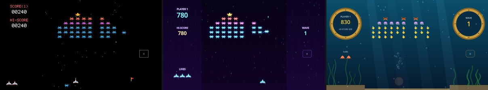

| Estilo | O que é |
|---|---|
| **Clássico 1979** | Fundo negro com estrelas coloridas a cair e a piscar, naves em píxeis multicolores, o míssil pousado na ponta da nave, bandeiras de vaga e o zumbido contínuo da formação. |
| **Neon** | Naves de luz com rasto nos mergulhos, estrelas em riscos de velocidade, faíscas e ondas de choque. |
| **Oceano** | A batalha no fundo do mar: um cardume de peixes, medusas, caranguejos e tamboris (com a lanterna acesa) contra um pequeno submarino. Bolhas, raios de luz, tinta e sons de sonar. |

Os desenhos das naves são originais (no mesmo espírito, mas não são os sprites da Namco).

### Controlos

Iguais aos do Ataque Alienígena: ← → (A / D), rato ou comando; disparar com Espaço / clique / A. No ecrã tátil, arrastar move e o dedo pousado dispara sozinho.

### Regras (iguais ao original)

- Formação de 46: 2 almirantes, 6 escoltas, 8 emissários e 30 zangões, a balançar de um lado para o outro.
- As naves descolam em arco e mergulham sobre o jogador a disparar; se escaparem, saem por baixo e voltam ao lugar.
- Pontos: zangão 30/60, emissário 40/80, escolta 50/100 (em formação / a mergulhar).
- Almirante: 60 em formação; a mergulhar vale 150 sozinho, 200 com 1 escolta, 300 com 2 — e **800** se abateres as escoltas antes dele.
- Só 1 míssil de cada vez. Vida extra aos 7000 pontos. Quando restam poucas naves, atacam sem parar.

## Pirilampo (1980)

*Inspirado em [Pac-Man](https://en.wikipedia.org/wiki/Pac-Man) (Namco, 1980).*

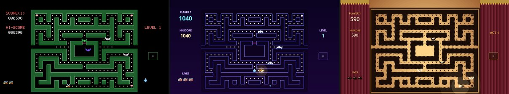

Um jogo **original** de perseguição em labirinto, no espírito dos arcades de 1980 (personagens, labirinto e nome próprios). Um pirilampo recolhe pontos de luz num jardim-labirinto, perseguido por 4 morcegos. As flores de luz fazem-no brilhar: os morcegos ficam encandeados, fogem, e podem ser apanhados.

| Estilo | O que é |
|---|---|
| **Arcade 1980** | Ecrã negro, sebes com contorno verde, pontos em píxeis, flores a piscar, pixel art e sons de chip — com grilos a cantar ao fundo. |
| **Neon** | Labirinto de tubos de luz, o pirilampo com um halo dourado, morcegos de néon e ondas de luz. |
| **Teatro de Sombras** | Jardim recortado em silhueta contra um ecrã de papel iluminado por trás, entre cortinas de veludo. Tudo é sombra menos a luz do pirilampo; os morcegos só se distinguem pelos olhos e, encandeados, passam a recortes de papel claro. Caixa de música, madeira e gongo. |

### Controlos

| | |
|---|---|
| Teclado | setas ou WASD (a direção fica memorizada até haver passagem) |
| Comando | D-pad ou analógico |
| Rato | clicar no ecrã escolhe a direção a partir do pirilampo |
| Ecrã tátil | deslizar o dedo na direção pretendida, em qualquer sítio |

### Regras

- Pontos de luz **10**, flores **50**; morcegos encandeados **200, 400, 800, 1600** em sequência.
- Cada morcego caça à sua maneira: o **Caçador** vai direito a ti, o **Emboscador** tenta pôr-se à tua frente, o **Cercador** fecha-te pelo lado oposto ao Caçador e o **Errante** aproxima-se mas foge quando fica perto.
- Os morcegos alternam entre "dispersar" (cada um para o seu canto) e "caçar"; ao mudar, dão meia-volta.
- Túneis nas laterais (os morcegos abrandam lá dentro). Bónus do jardim 2 vezes por nível (gota de orvalho, bolota, cogumelo, trevo, girassol, pinha, lua, estrela).
- O encandeamento dura menos a cada nível. Vida extra aos 10 000 pontos. Modo de 2 jogadores à vez.

## Travessia (1981)

*Inspirado em [Frogger](https://en.wikipedia.org/wiki/Frogger) (Konami, 1981).*

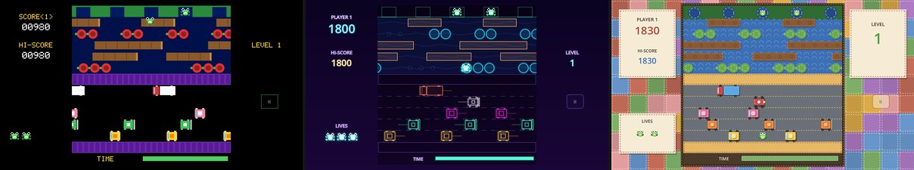

| Estilo | O que é |
|---|---|
| **Clássico 1981** | Rio azul-noite, estrada negra, passeios roxos, sebe com 5 tocas, veículos e rã em píxeis, barra de tempo e uma melodia de chip (original). |
| **Neon** | Autoestrada de luz com rastos, rio de néon a ondular, veículos em contornos brilhantes e uma rã verde-ácida. |
| **Feltro** | Um livro de atividades em feltro: peças recortadas com pespontos à vista, botões a fazer de olhos e de rodas, rio com ondas cosidas e painéis em retalhos. Apitos de brinquedo, xilofone e caixa de música. |

Desenhos originais (rã, veículos, tartarugas, crocodilo e mosca).

### Controlos

| | |
|---|---|
| Teclado / comando | setas, WASD ou D-pad: um salto por toque (manter = saltos seguidos) |
| Rato | clicar no ecrã salta nessa direção, a partir da rã |
| Ecrã tátil | deslizar o dedo na direção pretendida; um toque simples salta em frente |

### Regras (iguais ao original)

- Atravessar 5 faixas de estrada e 5 de rio (troncos e tartarugas) até uma das 5 tocas.
- 10 pontos por cada linha nova, 50 por rã em casa + 10 por cada meio segundo que sobra no relógio; 1000 ao encher as 5 tocas (e sobe o nível, tudo mais rápido).
- Mosca numa toca: +200. A partir do nível 2 aparece um crocodilo nas tocas; a partir do 3 mergulham mais tartarugas.
- Perde-se uma vida ao ser atropelado, cair à água, ser levado para fora do ecrã, entrar numa toca ocupada ou ficar sem tempo. Vida extra aos 10 000 pontos.

## Cogumelos (1981)

*Inspirado em [Centipede](https://en.wikipedia.org/wiki/Centipede_(video_game)) (Atari, 1981).*

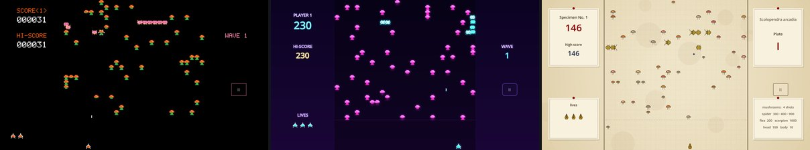

| Estilo | O que é |
|---|---|
| **Clássico 1981** | Fundo negro e pixel art com as cores a mudar a cada vaga, como na máquina; cogumelos envenenados com as cores trocadas e a batida dos passos da centopeia. |
| **Neon** | Cogumelos fosforescentes, centopeia de luz, aranha elétrica, faíscas e ondas de choque. |
| **Gravura Naturalista** | Uma prancha de um caderno de campo do séc. XIX: cogumelos em aguarela com tracejado sépia, centopeia gravada com patas a mexer, aranha, pulga e escorpião à pena, e um aparo que dispara gotas de tinta. Fichas de espécime nas laterais; sons de pena, papel e cravo. |

Desenhos originais (cogumelos, centopeia, atirador, aranha, pulga e escorpião).

### Controlos

| | |
|---|---|
| Teclado / comando | setas, WASD ou analógico para mover (na zona de baixo); Espaço / A para disparar (manter = rajada) |
| Rato | o atirador segue o cursor; manter o botão dispara |
| Ecrã tátil | arrastar em qualquer sítio move o atirador; com o dedo no ecrã dispara sozinho |

### Regras (iguais ao original)

- A centopeia (12 segmentos) desce em zigue-zague: ao bater num cogumelo ou na margem desce uma linha e inverte. Cada segmento abatido vira cogumelo e o seguinte passa a cabeça.
- Cabeça **100**, corpo **10**; cogumelos aguentam 4 tiros (**+1** ao destruir).
- Pulga (**200**, 2 tiros) cai a semear cogumelos quando há poucos em baixo; aranha (**300/600/900**, conforme a distância) salta na zona do jogador e come cogumelos; escorpião (**1000**) envenena cogumelos — a centopeia que lhes toca mergulha a direito.
- Quando a centopeia chega a baixo, entram cabeças novas pelas laterais. Ao perder uma vida, os cogumelos danificados são reparados (**+5** cada).
- A cada vaga há mais cabeças soltas e as cores mudam. Vida extra a cada **12 000** pontos. Modo de 2 jogadores à vez.

## Incursão (1982)

*Inspirado em [Penetrator](https://en.wikipedia.org/wiki/Penetrator_(video_game)) (Melbourne House, 1982).*

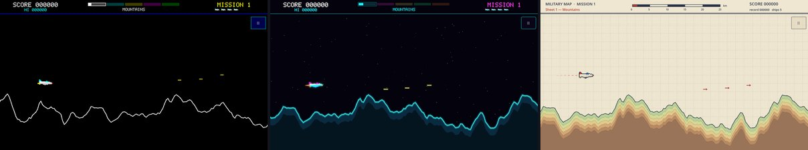

| Estilo | O que é |
|---|---|
| **Clássico 1982** | Fundo preto e o terreno desenhado só com a linha de contorno, uma cor por zona, como nos micros de 8 bits; sons de altifalante. |
| **Neon** | Céu estrelado em paralaxe, terreno escuro com contornos de luz (um par de cores por zona), nave e inimigos com halo. |
| **Mapa Topográfico** | A missão numa carta militar em corte: papel quadriculado, terreno em tintas hipsométricas com curvas de nível, inimigos como símbolos de mapa, cartela e escala gráfica. |

Nave, mísseis, radares, discos e depósito são desenhos originais.

### Controlos

| | |
|---|---|
| Teclado / comando | setas / WASD / analógico para mover; Espaço, Z ou A dispara; X, B, Ctrl ou botão B larga bombas |
| Ecrã tátil | arrastar na metade esquerda move a nave; metade direita: em cima dispara (manter), em baixo larga uma bomba |

### Regras (como no original)

- Cinco zonas por missão: Montanhas, Cavernas, Base de Radares, Túneis e Arsenal. Bater no terreno custa uma vida e recomeças no início da zona.
- Os mísseis saem do chão quando te aproximas (**50** no chão, **80** no ar); radares **100**, discos voadores **150**.
- No fundo do Arsenal está o depósito de bombas: aguenta **6** bombas. Destruí-lo cumpre a missão (**1000** + bónus) e a seguinte é mais rápida e com mais mísseis.
- Vida extra a cada **10 000** pontos.

## Galinheiro (1983)

*Inspirado em [Chuckie Egg](https://en.wikipedia.org/wiki/Chuckie_Egg) (A&F Software, 1983).*

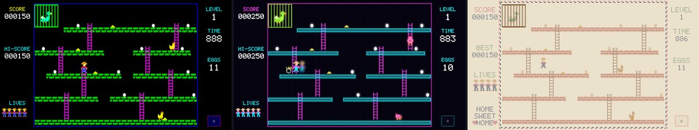

| Estilo | O que é |
|---|---|
| **Clássico 1983** | A paleta de 8 cores dos micros de 8 bits: fundo preto, tijolos verdes, escadas magenta, galinhas amarelas e os "bips" do altifalante interno. |
| **Neon** | A quinta à noite em tubos de luz: plataformas ciano, escadas magenta, galinhas cor-de-rosa e ovos com halo. |
| **Ponto de Cruz** | O nível bordado num pano de linho, como um "sampler" de quinta: cada píxel é um ponto em X, letras bordadas, moldura em ponto atrás e sons de caixa de música. |

Os 8 níveis, o agricultor, as galinhas e o pato são desenhos originais.

### Controlos

| | |
|---|---|
| Teclado / comando | setas / WASD / cruzeta para andar e subir/descer escadas; Espaço, Z, J ou A para saltar |
| Ecrã tátil | arrastar na metade esquerda do ecrã (andar e escadas); tocar na metade direita para saltar |

### Regras (como no original)

- Apanha os **12 ovos** de cada nível (**100** cada) sem tocar nas galinhas. O grão vale **50** e para o relógio durante 3 s — mas as galinhas também o comem.
- Salta entre plataformas, agarra escadas a meio do salto e usa os elevadores (cuidado com o teto!). Cair por um buraco no chão custa uma vida.
- O tempo que sobra passa para os pontos. Depois do nível 8 os níveis repetem-se com o **pato gigante** solto, a perseguir-te; mais à frente as galinhas ficam mais rápidas e há mais.
- Vida extra a cada **10 000** pontos. Modo de 2 jogadores à vez (cada um guarda o seu nível e os ovos que faltam).

## Astronauta a Jato (1983)

*Inspirado em [Jetpac](https://en.wikipedia.org/wiki/Jetpac) (Ultimate Play the Game, 1983).*

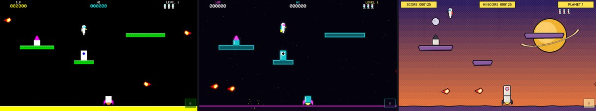

| Estilo | O que é |
|---|---|
| **Clássico 1983** | Fundo preto, plataformas verdes, chão amarelo e cores puras dos micros de 8 bits; o foguete muda de cor a cada modelo. |
| **Neon** | Espaço profundo estrelado, plataformas em tubos de luz e tudo com halo; laser às cores. |
| **Banda Desenhada** | Uma revista de ficção científica dos anos 50: céu em degradê com retícula de pontos, planeta com anéis, traço grosso a preto, onomatopeias ("ZAP!", "BUM!") e legendas em caixas amarelas. |

Astronauta, foguetes, cápsulas, gemas e os oito tipos de alienígenas são desenhos originais.

### Controlos

| | |
|---|---|
| Teclado / comando | ← → para andar/voar, ↑ / W (ou B no comando) liga o propulsor; Espaço, Z, Ctrl ou A dispara o laser |
| Ecrã tátil | joystick na metade esquerda (puxar para cima liga o propulsor); tocar na metade direita dispara |

### Regras (como no original)

- O ecrã dá a volta nas laterais. No primeiro planeta (e a cada 4) é preciso montar o foguete: leva as duas peças até à base (**100** cada).
- Depois caem cápsulas de combustível, uma de cada vez: leva **6** até ao foguete e entra nele para descolar (**1000**).
- Cada planeta tem um tipo de alienígena diferente (meteoros, bolas peludas, bolhas, caças, cruzes, discos, saltões e bolhas gelatinosas). As gemas que caem valem **250**.
- Vida extra a cada **10 000** pontos.

## Torre das Relíquias (1984)

*Inspirado em [Knight Lore](https://en.wikipedia.org/wiki/Knight_Lore) (Ultimate Play the Game, 1984).*

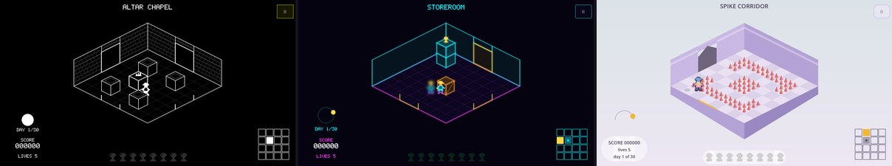

Jogo original inspirado nos jogos "Filmation" dos micros de 8 bits, como o Knight Lore: um castelo de 16 salas em perspetiva isométrica.

| Estilo | O que é |
|---|---|
| **Clássico 1984** | Fundo preto e cada sala desenhada numa só cor, com contornos e tijolos a traço, como nos jogos isométricos dos 8 bits. |
| **Neon** | A torre como uma maqueta de luz: chão em grelha, paredes de vidro, cubos em arame brilhante e altar dourado. |
| **Pastel Geométrico** | Ilustração geométrica suave: cubos em três tons de luz, chão em xadrez pastel, sombras macias e um céu que acompanha o dia (amanhecer, meio-dia, entardecer, noite). |

Explorador, guardas, fantasmas, relíquias, salas e mapa são originais.

### Controlos

| | |
|---|---|
| Teclado / comando | setas / WASD / analógico para andar (as diagonais do ecrã são os corredores); Espaço / A salta; E, X, Enter ou B pega/larga caixotes |
| Ecrã tátil | joystick na metade esquerda; metade direita: em cima salta, em baixo pega/larga |

### Regras

- Recolhe as **8 relíquias** espalhadas pelo castelo e leva-as ao altar da Capela (cada relíquia **500**, cada entrega **1000**, mais um bónus pelos dias que sobram). Tens **30 dias** (40 s cada).
- Os caixotes empurram-se, carregam-se e largam-se à tua frente — até em cima de um bloco. **Truque:** a meio de um salto, larga o caixote e ficas em cima dele.
- Há portas a meia altura: empilha o que for preciso para lá chegar.
- Espinhos, guardas, bolas e fantasmas tiram uma vida; recomeças à entrada da sala, que volta ao estado inicial. Os corações dão uma vida extra.

## Encaixe (1984)

*Inspirado em [Tetris](https://en.wikipedia.org/wiki/Tetris) (Alexey Pajitnov, 1984).*

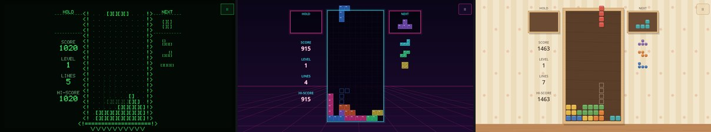

Jogo original inspirado no clássico das peças que caem (o Tetris): peças de quatro quadrados caem num poço de 10 x 20; roda-as e encaixa-as para completar linhas, que desaparecem. Segue as regras modernas: saco de 7 peças, rotação com "chutes" nas paredes, peça guardada, sombra de onde a peça vai cair, espera antes de assentar, queda rápida e queda imediata. A música é a canção popular russa "Korobeiniki" (domínio público), num arranjo próprio com um timbre por estilo.

| Estilo | O que é |
|---|---|
| **Clássico 1984** | O ecrã de texto verde dos terminais dos anos 80: poço desenhado com "<!" e "!>", peças feitas de "[ ]", linhas de varrimento e brilho de fósforo. Sons de altifalante. |
| **Neon** | Tubos de luz sobre fundo escuro com uma grelha em perspetiva; peças a brilhar, faíscas nas linhas completas e sintetizador com bateria. |
| **Brinquedo de Madeira** | Peças de madeira pintada com veios e arestas boleadas, numa caixa de faia sobre a mesa de um quarto de brincar; sons de madeira e marimba e música de caixinha de música. |

### Controlos

| | |
|---|---|
| Teclado | ← → mover; ↓ descer depressa; Espaço deixar cair; ↑ ou X rodar; Z ou Ctrl rodar ao contrário; C ou Shift guardar a peça |
| Comando | cruz para mover e descer, ↑ deixa cair; A roda, B roda ao contrário; LB/RB guardam |
| Ecrã tátil | arrasta para os lados para mover e para baixo para descer; toca para rodar (metade esquerda: ao contrário); gesto rápido para baixo deixa cair, para cima guarda |

### Regras

- 1, 2, 3 ou 4 linhas de uma vez valem 100, 300, 500 ou 800 pontos, vezes o nível; 4 linhas seguidas de outras 4 valem mais 50%, e jogadas seguidas que fazem linhas dão bónus.
- A cada 10 linhas sobe o nível e as peças caem mais depressa. O jogo acaba quando uma peça já não cabe no poço.

## Sarilhos na Escola (1985)

*Inspirado em [Skool Daze](https://en.wikipedia.org/wiki/Skool_Daze) (Microsphere, 1985).*

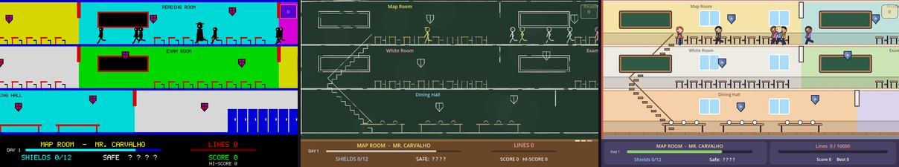

Jogo original inspirado no Skool Daze: o Zé tem de tirar o boletim do cofre do gabinete do diretor. A escola tem três pisos, salas, escadas, refeitório e recreio; há um horário de aulas a cumprir, colegas (o Brutamontes que bate, o Marrão que faz queixinhas, o Traquinas que anda com a fisga) e quatro professores de beca e barrete que dão linhas de castigo a quem apanham em asneiras.

| Estilo | O que é |
|---|---|
| **Clássico 1985** | As cores fortes dos computadores de 8 bits: cada sala numa cor "de atributo", pisos e paredes grossos, escadas em degraus e personagens só a tinta preta, com letras de píxeis. |
| **Giz no Quadro** | A escola inteira desenhada a giz num quadro de ardósia: traços tremidos, giz de várias cores, bonecos de pauzinhos e um parapeito de madeira com o painel. |
| **Desenho Animado** | Uma escola de desenho animado moderno: paredes pastel, soalho de madeira, janelas, cacifos, contornos grossos e personagens de cabeça grande e olhos expressivos. |

### Controlos

| | |
|---|---|
| Teclado / comando | ← → andar; ↑ ↓ subir e descer escadas (e ↑ junto ao cofre para o abrir); Espaço / A saltar; X ou J / X fisga; Z ou K / B murro |
| Ecrã tátil | joystick na metade esquerda; metade direita: em cima salta, ao meio fisga, em baixo murro |

### Regras

- Segue o horário (no painel): vai à sala certa a cada aula e ao refeitório ao almoço. Se faltares, se te virem com a fisga ou à pancada, ou no gabinete do diretor, levas linhas. Com 10000 linhas és expulso.
- Os professores não veem o que se passa nas costas deles — por exemplo, enquanto escrevem no quadro.
- Primeiro acerta em todos os 12 escudos das paredes, aos saltos; os mais altos só se alcançam em cima de um colega caído.
- Depois, deita cada professor abaixo com a fisga: ao levantar-se diz a sua letra do segredo do cofre (se te vir a atirar, também te dá linhas). Com as 4 letras, abre o cofre no gabinete do diretor e passas de nível.

## Estrada do Sol (1986)

*Inspirado em [Out Run](https://en.wikipedia.org/wiki/Out_Run) (Sega, 1986).*

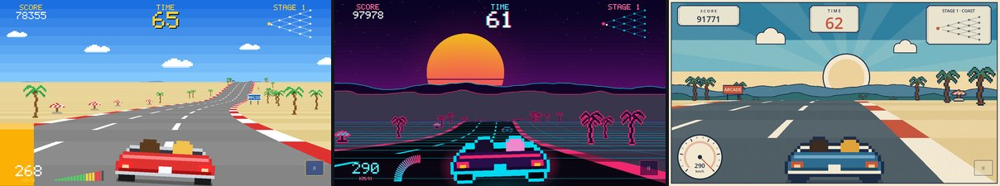

| Estilo | O que é |
|---|---|
| **Clássico 1986** | Céu azul de verão com nuvens, cores saturadas, bermas às riscas e cenário em sprites que crescem em direção ao ecrã; HUD amarelo com conta-rotações. |
| **Synthwave** | Noite eterna: sol às riscas no horizonte, montanhas de arame, chão em grelha néon, silhuetas com contorno brilhante e farolins a brilhar. Cada região tem o seu par de cores néon. |
| **Cartaz de Viagem** | A estrada como um cartaz turístico Art Déco dos anos 30: céu em faixas lisas, sol com raios, montanhas recortadas a tinta, papel com grão, placas no HUD e velocímetro de mostrador. |

Carro descapotável genérico, trânsito, cenário e as três músicas do rádio são originais (compostas e sintetizadas em código).

### Controlos

| | |
|---|---|
| Teclado / comando | setas / WASD / analógico para virar, ↑ W / A / gatilho direito para acelerar, ↓ S / B / gatilho esquerdo para travar; Espaço / Shift / X muda a mudança (caixa manual) |
| Rato | manter o botão esquerdo acelera (direito trava) e o carro segue o cursor |
| Ecrã tátil | arrastar o dedo para os lados vira (volante virtual); 1 dedo acelera, 2 dedos travam |

### Regras (como no original)

- Contrarrelógio por 5 etapas. No fim de cada uma a estrada **bifurca**: o lado que escolheres decide a região seguinte (Costa, Deserto, Floresta, Alpes, Cidade, Vinhas) — 5 metas possíveis, como na pirâmide do original (o mapa no canto mostra o caminho).
- Cada ponto de controlo dá tempo extra; o tempo restante na meta vale bónus.
- Fora de estrada o carro abranda; bater no cenário ou num carro a alta velocidade faz o carro capotar. A baixa velocidade, só há um toque.
- Nas curvas o carro é puxado para fora: nas mais apertadas, alivia o acelerador.
- Caixa automática ou manual (mudança baixa arranca bem mas não passa dos 174 km/h). Rádio: Onda Atlântica, Estrada Mágica, Pôr do Sol ou desligado.

## Espada do Vale (1986)

*Inspirado em [The Legend of Zelda](https://pt.wikipedia.org/wiki/The_Legend_of_Zelda_(jogo_eletr%C3%B4nico)) (Nintendo, 1986).*

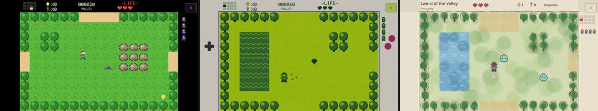

Aventura original de vista aérea inspirada nos clássicos de espada e masmorras: um vale de 12 ecrãs e uma masmorra de 6 salas.

| Estilo | O que é |
|---|---|
| **Clássico 1986** | Casas de 16 x 16 píxeis como nas consolas de 8 bits — relva, árvores redondas, rochas, água a ondular, masmorra de tijolo — e HUD preto. |
| **Consola Portátil** | Os mesmos desenhos em só 4 tons de verde, com a grelha de píxeis do ecrã de cristal líquido e a moldura cinzenta das portáteis de 1989. |
| **Aguarela** | Cada ecrã pintado como uma ilustração de livro de contos: manchas de aguarela sobre papel, árvores e rochas com traço a tinta, água em camadas e HUD escrito na margem. |

Herói, inimigos, mapas e o Guardião de Pedra são originais.

### Controlos

| | |
|---|---|
| Teclado / comando | setas / WASD / cruzeta para andar (4 direções); Espaço, Z, X ou A dá um golpe de espada |
| Ecrã tátil | joystick na metade esquerda; tocar na metade direita dá um golpe |

### Regras

- Encontra a gruta nas montanhas a nordeste e entra na masmorra. Para recuperar o **Cristal do Vale**, derrota o **Guardião de Pedra**.
- Na masmorra, limpar certas salas faz aparecer uma chave; as chaves abrem as portas trancadas.
- A espada corta arbustos (às vezes há moedas ou corações escondidos). Há um coração extra no vale e outro na masmorra.
- Inimigos: lodos saltitões, morcegos, goblins arqueiros e cavaleiros. Tens 3 vidas: ao perder todos os corações, recomeças no início do vale ou à entrada da masmorra.

## Fuga do Palácio (1989)

*Inspirado em [Prince of Persia](https://pt.wikipedia.org/wiki/Prince_of_Persia_(jogo_eletr%C3%B4nico_de_1989)) (Jordan Mechner, 1989).*

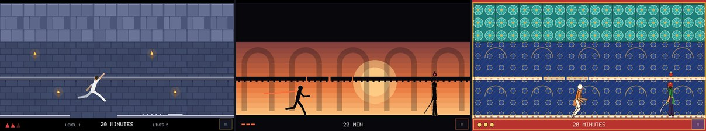

Jogo original inspirado nos plataformas "cinemáticos" da época, como o Prince of Persia. As personagens são esqueletos animados por poses interpoladas, para uma animação suave, sem folhas de sprites.

| Estilo | O que é |
|---|---|
| **Clássico 1989** | Masmorras de pedra azulada com tijolos, lajes de aresta clara e tochas a tremeluzir; herói de branco e guardas de turbante colorido. |
| **Silhueta** | Teatro de sombras ao pôr do sol: o palácio e as personagens a negro contra um céu em degradê, arcos ao longe e um lenço que esvoaça atrás do herói. |
| **Iluminura Persa** | O palácio pintado como uma miniatura persa: fundo lápis-lazúli com estrelas a ouro, paredes de azulejo turquesa, lajes de mármore, trajes coloridos, cimitarras e moldura dourada. |

### Controlos

| | |
|---|---|
| Teclado / comando | ← → correr; Shift + ← → passo cuidadoso; Espaço salta (a correr = salto longo); ↑ salta para cima, agarra e sobe beirais, entra na porta; ↓ baixa-se, desce de um beiral ou larga-o; X / J espada (↑ defende) |
| Ecrã tátil | joystick na metade esquerda (↑/↓ para subir e descer); metade direita: em cima salta, ao meio passo cuidadoso, em baixo espada |

### Regras

- Tens **20 minutos** para atravessar os dois níveis do palácio. Ao morrer recomeças o nível, mas o relógio não para.
- Cair uma linha não faz mal, duas tiram um triângulo de vida e três são fatais. A cair, ↑ agarra o beiral mais próximo.
- Os espinhos só apanham quem corre ou aterra em cima deles; atravessa-os com o passo cuidadoso. O chão solto cai pouco depois de o pisares.
- As placas abrem os portões durante 12 segundos. A placa da saída abre a porta do fim do nível.
- Com a espada, os guardas obrigam-te a lutar: ataca, defende (↑) e avança ou recua. As poções vermelhas curam e as verdes dão mais vida.

## Rebanho (1991)

*Inspirado em [Lemmings](https://pt.wikipedia.org/wiki/Lemmings_(jogo_eletr%C3%B4nico)) (DMA Design / Psygnosis, 1991).*

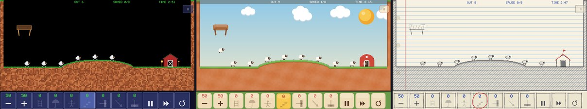

Jogo original inspirado nos puzzles como o Lemmings: as ovelhas saem do curral e caminham sozinhas, sem medo de nada; tens de lhes dar funções para que cheguem ao celeiro. O terreno é um mapa de píxeis que se escava e constrói à medida que se joga. Seis níveis, do passeio ao "tudo junto".

| Estilo | O que é |
|---|---|
| **Clássico 1991** | O aspeto dos puzzles de 16 bits: fundo negro, terra granulada com relva, placas de aço rebitadas, ovelhas de poucos píxeis, alçapão de madeira e celeiro vermelho com tochas. Painel azul com números verdes. |
| **Plasticina** | Tudo moldado à mão: barro cor de terracota com relva de plasticina, nuvens e sol de massa, ovelhas fofas feitas de bolinhas e botões de plasticina. |
| **Bloco de Notas** | Um rabisco a lápis numa folha pautada: terreno a grafite tracejado, aço a esferográfica azul, tijolos a caneta vermelha e ovelhas com contorno tremido que "ferve", como nos desenhos animados feitos à mão. |

### Controlos

| | |
|---|---|
| Rato / ecrã tátil | toca num botão do painel para escolher a função e depois numa ovelha para a atribuir; − / + mudam o ritmo de saída; pausa, rapidez e recomeçar no painel |
| Teclado / comando | 1–7 ou Q / E (LB / RB) escolhem a função; setas / WASD / manípulo movem o cursor; Espaço / Enter / A atribui; F (Y) rapidez; R (Back) recomeça o nível; Esc pausa |

### Regras

- Cada nível diz quantas ovelhas tens de salvar e quanto tempo há. Se não chegares lá, repetes o nível.
- Funções: **Trepadora** (sobe paredes), **Guarda-chuva** (cai devagar, sem se magoar), **Bloqueadora** (faz as outras darem meia-volta), **Construtora** (12 degraus de ponte), **Escavadora** (túnel em frente), **Mineira** (túnel na diagonal) e **Cavadora** (buraco para baixo).
- Uma queda grande é fatal, a não ser com guarda-chuva. O aço não se escava.

## Estrutura

```
core/                  partilhado por todos os jogos
  main.gd / main.tscn  ecrã inicial (lista de jogos e rodapé "inspirado em")
  inspirations.gd      os clássicos que inspiraram cada jogo: breve história e ligação para a Wikipédia
  synth.gd             sintetizador: os sons são gerados em código, sem ficheiros de áudio
  ui.gd                tema dos menus gerado a partir da palete de cada estilo
  cycle_button.gd      botão de opções  <  valor  >
  block_digits.gd      algarismos em blocos dos marcadores clássicos
  pixel_font.gd        letra de píxeis 5x7 (estilo arcade)
  pixel_art.gd         texturas de píxeis multicolores (e brilhos desfocados)
  settings.gd          preferências guardadas (user://settings.cfg)
  i18n.gd              traduções (I18n.t); os textos estão em i18n/strings.json
games/pong/
  pong_game.gd         lógica pura do jogo (física, regras, CPU, toque) — emite sinais
  pong_main.gd         menus, pausa, fim de jogo, troca de estilo
  skins/pong_skin.gd   classe base de um estilo (desenho + sons + reação a eventos)
  skins/classic_skin.gd, neon_skin.gd, paper_skin.gd
games/breakout/
  breakout_game.gd     lógica pura (física, tijolos, regras, CPU da demo, input)
  breakout_main.gd     menus, avisos, pausa, fim de jogo, recorde
  skins/breakout_skin.gd  classe base
  skins/classic_skin.gd, neon_skin.gd, glass_skin.gd (Vitral)
games/invaders/
  invaders_game.gd     lógica pura (frota, abrigos, bombas, disco, vidas, vagas, CPU da demo)
  invaders_main.gd     menus, avisos, pausa, fim de jogo, recorde
  invader_sprites.gd   desenhos em píxeis partilhados pelos 3 estilos
  skins/invaders_skin.gd  classe base
  skins/classic_skin.gd, neon_skin.gd, azulejo_skin.gd
games/asteroids/
  asteroids_game.gd    lógica pura (nave, tiros, asteroides, discos, hiperespaço, batida, controlos)
  asteroids_main.gd    menus, joystick tátil, pausa, fim de jogo, recorde
  skins/asteroids_skin.gd  classe base
  skins/classic_skin.gd, neon_skin.gd, origami_skin.gd
games/galaxian/
  galaxian_game.gd     lógica pura (formação, mergulhos, escoltas, bónus, bombas, vagas, CPU da demo)
  galaxian_main.gd     menus, avisos, pausa, fim de jogo, recorde
  galaxian_sprites.gd  desenhos multicolores
  skins/galaxian_skin.gd  classe base
  skins/classic_skin.gd, neon_skin.gd, ocean_skin.gd
games/firefly/
  firefly_game.gd      lógica pura (labirinto, movimento por casas, IA dos 4 morcegos, encandeamento, bónus)
  firefly_main.gd      menus, avisos, pausa, fim de jogo, recorde
  firefly_sprites.gd   pirilampo, morcegos, flor e bónus em pixel art
  skins/firefly_skin.gd  classe base
  skins/arcade_skin.gd, neon_skin.gd, shadow_skin.gd
games/frogger/
  frogger_game.gd      lógica pura (faixas, troncos, tartarugas que mergulham, tocas, relógio, CPU da demo)
  frogger_main.gd      menus, avisos, pausa, fim de jogo, recorde
  skins/frogger_skin.gd  classe base (desenhos da rã, mosca e crocodilo; veículos por partes)
  skins/classic_skin.gd, neon_skin.gd, felt_skin.gd
games/centipede/
  centipede_game.gd    lógica pura (centopeia em segmentos, cogumelos, pulga, aranha, escorpião, reparação, CPU)
  centipede_main.gd    menus, avisos, pausa, fim de jogo, recorde
  skins/centipede_skin.gd  classe base (desenhos em píxeis)
  skins/classic_skin.gd, neon_skin.gd, engraving_skin.gd
games/penetrator/
  penetrator_game.gd   lógica pura (terreno por colunas, 5 zonas, mísseis, radares, discos, depósito, bombas, CPU)
  penetrator_main.gd   menus, avisos, pausa, fim de jogo, recorde
  skins/penetrator_skin.gd  classe base (desenhos, terreno em faixas num só lote, explosões)
  skins/classic_skin.gd, neon_skin.gd, topo_skin.gd
games/chuckie/
  chuckie_game.gd      lógica pura (8 níveis, saltos, escadas, elevadores, galinhas, pato, tempo, CPU que planeia caminhos)
  chuckie_main.gd      menus, avisos, pausa, fim de jogo, recorde
  skins/chuckie_skin.gd  classe base (desenhos em píxeis, cenário gravado numa textura por nível)
  skins/classic_skin.gd, neon_skin.gd, stitch_skin.gd
games/jetpac/
  jetpac_game.gd       lógica pura (voo com propulsor, ecrã que dá a volta, foguete, combustível, 8 alienígenas, CPU)
  jetpac_main.gd       menus, avisos, pausa, fim de jogo, recorde
  skins/jetpac_skin.gd classe base (desenhos em píxeis, explosões)
  skins/classic_skin.gd, neon_skin.gd, comic_skin.gd
games/relics/
  relics_game.gd       lógica pura (16 salas, física 3D em caixas, caixotes, portas a várias alturas, perigos, dias, CPU)
  relics_main.gd       menus, avisos, pausa, fim de jogo, recorde
  skins/relics_skin.gd classe base (projeção isométrica, ordem de desenho, cubos, paredes e portas)
  skins/classic_skin.gd, neon_skin.gd, pastel_skin.gd
games/vale/
  vale_game.gd         lógica pura (ecrãs do vale e da masmorra, espada, inimigos, chaves, portas, chefe, CPU)
  vale_main.gd         menus, avisos, pausa, fim de jogo, recorde
  skins/vale_skin.gd   classe base (ecrã pintado numa textura, deslizar entre ecrãs, desenhos, corações)
  skins/classic_skin.gd, gameboy_skin.gd, watercolor_skin.gd
games/palace/
  palace_game.gd       lógica pura (níveis em casas, corrida com inércia, saltos, beirais, quedas, armadilhas, espadas, CPU)
  palace_main.gd       menus, avisos, pausa, fim de jogo, recorde
  skins/palace_skin.gd classe base (esqueletos com poses interpoladas, ecrã gravado numa textura)
  skins/classic_skin.gd, silhouette_skin.gd, miniature_skin.gd
games/blocks/
  blocks_game.gd       lógica pura (poço, peças, rotação com chutes, saco de 7, guardar, espera para assentar, pontos, CPU, gestos táteis)
  blocks_music.gd      a música (Korobeiniki, domínio público) em três arranjos, com o sintetizador do OutRun
  blocks_main.gd       menus, pausa, fim de jogo, recorde
  skins/blocks_skin.gd classe base (poço, sombra, próximas peças, peça guardada, partículas, avisos, música)
  skins/classic_skin.gd, neon_skin.gd, wood_skin.gd
games/school/
  school_game.gd       lógica pura (escola de 3 pisos, escadas, horário, aulas, professores e colegas, linhas, escudos, letras, cofre, CPU)
  school_main.gd       menus, avisos (campainha, letras, cofre), pausa, expulsão, recorde
  skins/school_skin.gd classe base (escola gravada numa textura, câmara, figuras animadas por poses, balões de fala, painel)
  skins/classic_skin.gd, chalk_skin.gd, cartoon_skin.gd
games/flock/
  flock_game.gd        lógica pura (terreno de 320 x 150 píxeis, ovelhas e funções, níveis e soluções da demo, painel, cursor)
  flock_main.gd        menus, avisos entre níveis, pausa, vitória, recorde
  skins/flock_skin.gd  classe base (terreno numa imagem atualizada só onde muda, ovelhas, painel de 12 botões)
  skins/classic_skin.gd, clay_skin.gd, notebook_skin.gd
games/outrun/
  outrun_game.gd       lógica pura (estrada em segmentos com curvas e colinas, bifurcações, trânsito, tempo, CPU)
  outrun_main.gd       menus, contagem, avisos, pausa, fim de corrida, recorde
  outrun_music.gd      as 3 músicas do rádio (compostas em notação simples e sintetizadas em segundo plano)
  skins/outrun_skin.gd classe base: projeção pseudo-3D, paisagem em paralaxe, desenhos em píxeis, motor
  skins/classic_skin.gd, synthwave_skin.gd, poster_skin.gd
```

**Criar um novo estilo**: estende a classe base do jogo (`PongSkin`, `BreakoutSkin`, `InvadersSkin`, `AsteroidsSkin`, `GalaxianSkin`, `FireflySkin`, `FroggerSkin`, `CentipedeSkin`, `PenetratorSkin`, `ChuckieSkin`, `JetpacSkin`, `RelicsSkin`, `ValeSkin`, `PalaceSkin`, `OutRunSkin`), desenha em `_draw()` a partir de `game`, cria os sons em `_build_sfx()` e acrescenta-o a `SKINS` no `*_main.gd` do jogo.

**Acrescentar um novo jogo**: cria `games/<jogo>/<jogo>_main.gd` (um `Node` com o sinal `exit_requested` e o método `go_back()`), regista-o em `GAMES` no `core/main.gd` e acrescenta a sua inspiração em `core/inspirations.gd`.

As pastas e as classes mantêm os nomes curtos internos usados durante o desenvolvimento (`pong`, `breakout`...).

**Traduções**: o texto original (em português) é a chave; o código envolve cada texto visível com `I18n.t("...")`. O inglês e o espanhol estão em `i18n/strings.json` (`{"texto em português": ["inglês", "espanhol"]}`); depois de o editar, corre `python3 i18n/build.py` para gerar de novo `i18n/strings.gd`. Um texto sem tradução aparece simplesmente em português. Para acrescentar um idioma, junta uma coluna ao JSON e a `I18n.LANGS`/`LANG_NAMES` em `core/i18n.gd`.

Renderizador: *Compatibility* (OpenGL), para correr em PCs antigos e na maioria dos telemóveis Android.

## Builds

Os presets de exportação já estão em `export_presets.cfg` (Windows, Linux, Android e Web).

### No editor
**Project → Export** → escolhe a plataforma → **Export Project**. Da primeira vez o Godot pede para descarregar os *export templates* (Editor → Manage Export Templates).

### Linha de comandos
```bash
./build.sh            # todas
./build.sh windows    # ou linux / android / web
```
(usa `GODOT=/caminho/para/godot` se o executável não estiver no PATH)

### Android
Precisa de, uma vez: **JDK 17**, **Android SDK** (com *platform-tools* e *build-tools*) e uma keystore de debug — tudo configurado em **Editor → Editor Settings → Export → Android**. Guia oficial: <https://docs.godotengine.org/en/stable/tutorials/export/exporting_for_android.html>.
O APK sai assinado com a chave de debug, pronto a instalar (`adb install builds/android/ArcadeClassico.apk`). Para a Play Store será preciso uma keystore de release e o formato AAB (Gradle build).

### Web
A versão Web é exportada sem threads (*Thread Support* desligado), por isso funciona em qualquer servidor de ficheiros, incluindo o GitHub Pages, sem cabeçalhos especiais. Para testar localmente: exporta para uma pasta e corre `python3 -m http.server` nessa pasta.

### Automático (GitHub Actions)
`.github/workflows/builds.yml` corre a cada push para `main`:
- gera as builds de Windows, Linux, Android e Web e deixa-as em **Actions → Artifacts**;
- publica a versão Web no **GitHub Pages** (é preciso ativar uma vez em **Settings → Pages → Source: GitHub Actions**); fica em [https://mcampilho.github.io/classic-games/](https://mcampilho.github.io/classic-games/);
- ao criar uma tag `v*` (`git tag v1.0.0 && git push --tags`), cria também uma **Release** com os ficheiros para descarregar.

## Licença

O código é distribuído sob a [licença MIT](LICENSE). O motor [Godot](https://godotengine.org) também é MIT.
